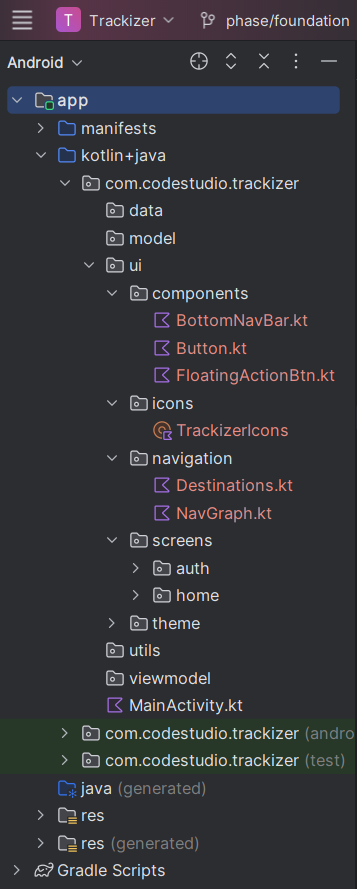
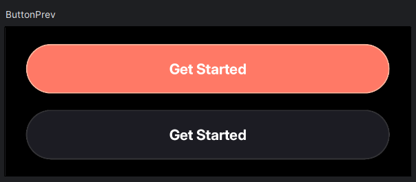
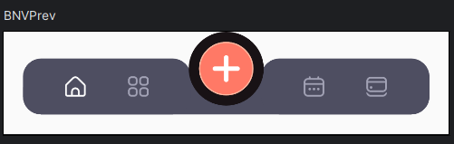

# Trackizer

Trackizer is a subscription tracking and management app designed to help users monitor their
subscriptions, stay on top of billing cycles, and manage expenses efficiently. This project
emphasizes modern Android development practices and provides a seamless user experience.

---

## 🚀 Features (Planned)

- User Authentication
- Subscription Tracking and Notifications
- Subscription Budget Management
- Data Visualization for Spending Insights
- Offline Support
- Push Notifications for Upcoming Renewals

---

## 🛠️ Tech Stack

- **Jetpack Compose**: UI Framework
- **Ktor**: Backend APIs
- **Room**: Local data storage
- **Firebase**: Remote sync and push notifications
- **MPAndroidChart**: Data visualization

---

## 🗓️ Weekly Progress Breakdown

### Week 1: Foundation (`phase/foundation`)

#### Deliverables:

1. **Organized Project**:
    - Set up a scalable and maintainable project structure.
2. **Mapped Designs**:
    - Created wireframes or mockups for key app screens (e.g., subscription list, dashboard, and
      settings).
3. **Added Libraries**:
    - Integrated essential libraries: `Jetpack Compose`, `Ktor`, `Room`, `Firebase`, and
      `MPAndroidChart`.
4. **Created Components**:
    - Developed reusable UI components (e.g., subscription cards, action buttons).

#### Screenshots:

| Description               | Image                                              |
|---------------------------|----------------------------------------------------|
| **Project Structure**     |  |
| **Wireframes/Mockups**    |     |
| **Initial UI Components** |             |

---

## 📊 Current Status

- ✅ Week 1: Foundation complete!
- 🕐 Week 2: Coming soon.

---

## 🖼️ Visuals

Visuals for the app will be added here as development progresses.

---

## 🤝 Contribution

Feel free to contribute by creating issues or submitting pull requests!

---

## 📄 License

This project is licensed under the MIT License.
